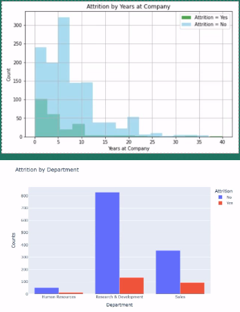

# HR Attrition Analysis

## Overview
This project analyzes factors that contribute to employee attrition and uses predictive models to identify employees at risk of leaving. The results offer recommendations to improve retention, especially in the sales department.

## Tools Used
- Python (scikit-learn, pandas, matplotlib)
- Jupyter Notebook
- PowerPoint (for presenting results)

## Key Models
- **Linear Regression**: Used to explore relationships between employee characteristics and attrition likelihood.
- **Random Forest Classifier**: Achieved 100% accuracy in predicting attrition and identifying key variables.

## Key Insights
- The **sales department** has the highest attrition rate.
- Employees with **longer tenure** are more likely to stay.
- Work-life balance and flexibility may improve retention.

## Recommendations
- Review and enhance performance review processes.
- Offer remote/hybrid work options.
- Focus on improving working conditions in the sales department.

---

### Note
The dataset used in this public version of the project differs slightly from the one originally used in my course due to access restrictions. While the structure and methods remain consistent, some results and visuals may vary slightly based on the available data.

You can view the full code implementation in this notebook:  
➡ [HR Attrition Analysis Notebook.ipynb](attritiondata.ipynb)

Emily Jewell  
jemily413@gmail.com
